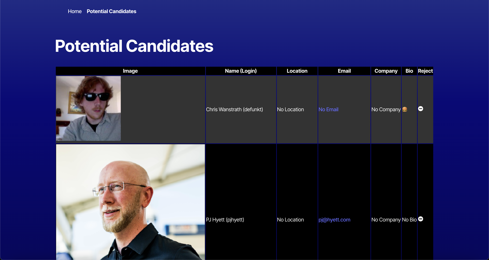

# Candidate-Search

## Table of Contents
- [Description](#description)
- [Installation](#installation)
- [Usage](#usage)
- [Contributing](#contributing)
- [License](#license)
- [Tests](#tests)
- [Questions](#questions)

# [Live Page]()

## Screenshot

## Description

A React & Typescript application that allows the user to browse through Github profiles and then add the profiles to a pool of potential candidates for hire. 

## Installation

Clone the repo and open up the integrated terminal in the main path of the project and type npm run dev to start the application.

## Usage

Use this application to accept or reject Github profiles that can be add to a pool of potential candidates. Once added as a potential candidate, the user is also able to take them off as a potential candidate.

## License

This project is licensed under the [MIT]([License](https://opensource.org/licenses/MIT)) license.

## Contributing

I was able to utilize an API that grabs Github profiles so that they can be used as potential candidates to be hired for this  React application.

## Tests

Npm run dev was utilized to open a the front-end of the application allowing me search for potential candidates.

## Questions
Here is a link to my [GitHub](https://github.com/Jthao04).

If you have any questions, you can reach me at [Jthao04@gmail.com](mailto:Jthao04@gmail.com).
